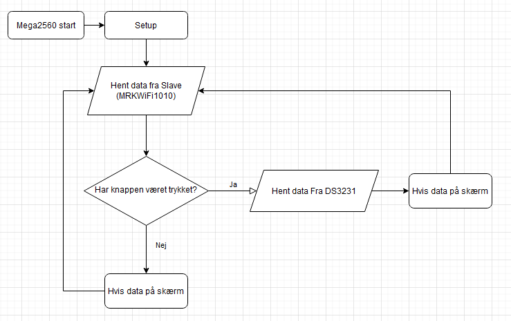
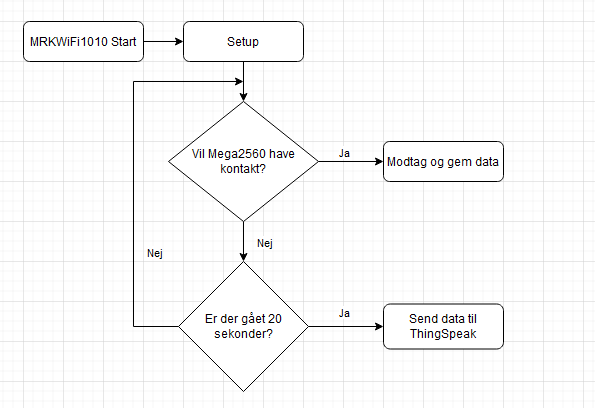
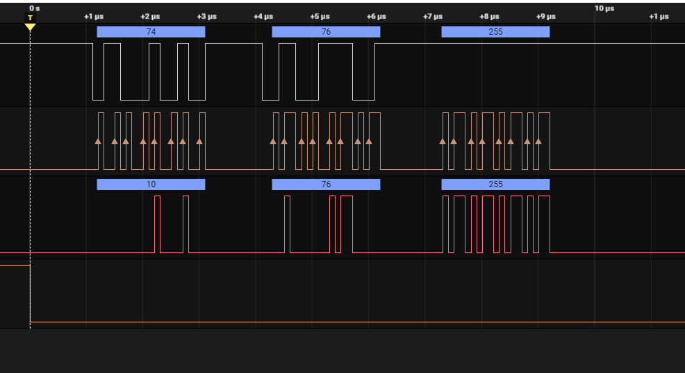

# Det_Intiligente_Hus
### Project beskrivelse
Meaga2560 har en DHT11, Display og en clock. 
Mega2560 sættes op som master og bruger spi til at sende humidity og temperaturen til MKRWiFi1010 som getmmer temperatur og humidity i thingspeak. 
Mega2560 printer så temperaturen ud til displayed så man kan se temperaturen. 
Du kan trykke på en knap så du kan se hvad klokken er istedet for temperaturen som skrifter tilbage efter 10 sekunder.

#### Version 2.0
Der kan også læses et kort som hvis matcher åbner en dør. 
ekstra mkrwifi1010 med DHT11 simulering af indørs og udendørs. 
Test af retain. 
Test af will.

## Flowchart
### Mega2560

### MRKWiFi1010

## Liste af librarys brugt
### Librarys på mega2560
* Arduino
* SPI
* Wire
* Adefruit_BusIO
* Adafruit_GFX_Library
* Adafruit_SSD1306
* Adafruit Unified Sensor
* DHT sensor library

### Librarys på MRKWiFi1010
* Arduino
* WiFiNINA
* ThingSpeak
* SercomSPISlave (Har lavet en port om for Sercom1, så den bruger PA21(pin 7, SS) istedfor PA18 som ikke eksitere på borded jeg brugere.)

## Analyse SPI

## Setup
### MRKWiFi1010
#### SPI
* Put MISO kablet i pin 10
* Put SCK kablet i pin 9
* Put MOSI kablet i pin 8
* Put SS kablet i pin 7
* Begge bords skal have samme ground
Husk level converter

### Mega2560
#### SPI
* Put MISO kablet i pin 50
* Put SCK kablet i pin 52
* Put MOSI kablet i pin 51
* Put SS kablet i pin 53
* Begge bords skal have samme ground
Husk level converter
#### Display
* SDA kablet til SDA pin
* SCL kablet til SCL pin
* VCC til 5v
* GND til ground
#### Clock
* SDA kablet til SDA pin
* SCL kablet til SCL pin
* VCC til 5v
* GND til ground
#### DHT11
* Signal til pin 2
* VCC til 5v
* GND til ground
#### Knap
* Et ben til ground
* Modsvarende ben til pin 3
